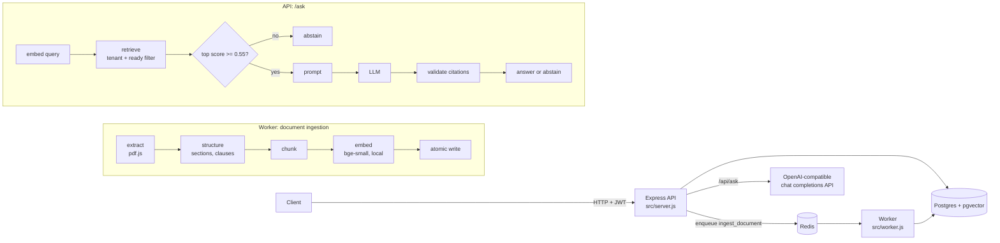

# FinSight

FinSight is a multi-tenant backend for financial operations. It has a double-entry ledger, invoicing with payments that post to the ledger, and a contract Q&A endpoint. You upload contract PDFs and ask questions about them. Answers use retrieval-augmented generation: the cited sources are checked on the server, and the endpoint abstains when the documents do not contain the answer. It is built with Node.js (ESM, plain JavaScript), Express 5, Drizzle ORM, PostgreSQL with pgvector, and BullMQ on Redis.

## Features

**Auth and tenants**
- `POST /api/auth/register` creates a tenant, a user and an `OWNER` membership in one transaction. Passwords are hashed with bcrypt (cost 12) and emails are trimmed and lowercased.
- `POST /api/auth/login` returns an HS256 JWT (15-minute expiry) that carries the user id, tenant id and role. Login compares against a dummy hash when the email is unknown, so response time does not reveal whether an email is registered.
- `GET /api/auth/me` returns the caller's user, tenant and role, read from the membership row rather than the token.
- `OWNER`s and `ADMIN`s can add users to their tenant as `ADMIN` or `MEMBER` (`POST /api/members`). The user and membership are created in one transaction, with the same bcrypt cost and email normalisation as registration. Any member can list the tenant's members.

**Accounts**
- Chart-of-accounts accounts are typed `ASSET`, `LIABILITY`, `EQUITY`, `REVENUE` or `EXPENSE`, with a 3-letter currency code. Names are unique per tenant.

**Ledger**
- Balanced journal entries with integer minor-unit amounts. Amounts are sent as strings so that values above `Number.MAX_SAFE_INTEGER` keep their precision. Every entry needs an `Idempotency-Key`.
- Entries can be listed with keyset pagination and filtered by account and date range. Account balances can be read as of a point in time and are sign-normalised by account type: `LIABILITY`, `EQUITY` and `REVENUE` are credit-normal and report the negated sum of their lines.
- `GET /api/ledger/balances` returns every account's balance in one SQL query, using the same sign rule (`signedBalance` in `ledger.service.js`).

**Invoices**
- An invoice has line items and a state machine: `DRAFT -> ISSUED -> PARTIALLY_PAID / PAID / OVERDUE`, and `VOID`. Every transition is written to `invoice_status_history`.
- Issuing an invoice posts the receivable in the same transaction: debit the accounts-receivable account and credit the revenue account for the invoice total (idempotency key `invoice-issue:<invoiceId>`). The entry's id is stored on the invoice as `issueJournalEntryId`.
- Payments are idempotent and post a balanced journal entry (debit the bank account, credit accounts receivable) in the same transaction. Once an invoice is fully paid, its receivable nets to zero.
- Invoice numbers are gapless and allocated per tenant (`INV-000001`, ...). The invoice list is paginated on the sequence number.
- A BullMQ job scheduler (cron `0 0 * * *`) marks past-due invoices `OVERDUE`. Admins can also trigger it with `POST /api/admin/invoices/mark-overdue`.

**Documents**
- Upload a PDF as `multipart/form-data` (field `file`, optional `title`). The limit is 10 MB and the file must start with the `%PDF-` magic bytes. The file bytes are stored in Postgres.
- Uploads are deduplicated per tenant by SHA-256. Re-uploading the same file returns the existing document with `200`; a new upload returns `202` and is queued for ingestion.
- A worker process ingests documents asynchronously. Status moves `pending -> processing -> ready | failed`.
- Documents can be listed (keyset pagination, optional `status` filter), downloaded as the original PDF, retried after a failure (`failed -> pending`, with a new ingestion job) and deleted (`OWNER`/`ADMIN`; the chunks, file and document are deleted in one transaction). A document can't be deleted while it is `processing`. A queued job whose document was deleted is skipped by the worker.

**/ask**
- `POST /api/ask` answers a question from the tenant's `ready` documents. Answers carry numbered citations (document, section, pages). The endpoint abstains when the documents do not support an answer.

## Correctness guarantees

| Guarantee | How it is enforced | Where it is tested |
| --- | --- | --- |
| Ledger idempotency | `UNIQUE (tenant_id, idempotency_key)` on `journal_entries`, plus `INSERT ... ON CONFLICT DO NOTHING` and a replay read in `createJournalEntryTx` | `test/concurrency.test.js` (1), `test/ledger/concurrency.test.js`, `test/ledger/idempotency.test.js` |
| Reusing an idempotency key with a different body is rejected (`409 IDEMPOTENCY_KEY_REUSED`) | A SHA-256 fingerprint of the canonicalised request body (sorted keys, bigint/Date aware) is stored and compared on replay | `test/concurrency.test.js` (2), `test/ledger/idempotency.test.js`, `test/lib/idempotency.test.js` |
| Payment idempotency (one payment and one journal entry per key) | `UNIQUE (tenant_id, idempotency_key)` on `invoice_payments`, the same conflict-and-replay pattern, and a request fingerprint | `test/concurrency.test.js` (3) |
| Journal entries sum to zero | Checked in the application, and backed by a `DEFERRABLE INITIALLY DEFERRED` constraint trigger on `entry_lines` that checks the sum at commit (`drizzle/0007_...`) | `test/concurrency.test.js` (7), `test/schema/entryLinesBalance.test.js` |
| Append-only ledger | `BEFORE UPDATE OR DELETE` triggers (`drizzle/0014_append_only_ledger.sql`). `entry_lines` can never be updated or deleted. `journal_entries` can never be deleted, and the only allowed update sets `reversed_by_entry_id` once | `test/schema/appendOnlyLedger.test.js` |
| Gapless per-tenant invoice numbers | `invoice_sequences` keeps one counter row per tenant. It is incremented with `INSERT ... ON CONFLICT DO UPDATE ... RETURNING` inside the invoice's own transaction, so a rollback also rolls back the number. `UNIQUE (tenant_id, sequence_number)` | `test/concurrency.test.js` (6), `test/invoices/pagination.test.js` |
| No overpayment under concurrency | The invoice row is locked with `SELECT ... FOR UPDATE`. The service sums all payments, including the new one, and rejects the payment with `PAYMENT_EXCEEDS_REMAINING` if the sum exceeds the total | `test/concurrency.test.js` (4), `test/invoices/paymentConcurrency.test.js` |
| Void and payment cannot both win | Issue, pay and void all take the same row lock. `voidInvoice` rejects invoices that have any recorded payment (`INVOICE_HAS_PAYMENTS`) | `test/concurrency.test.js` (5), `test/invoices/void.test.js` |
| Overdue job does not resurrect voided invoices | The update re-checks the status in its `WHERE` clause | `test/invoices/markOverdue.test.js` |
| Tenant isolation | Every tenant-facing lookup filters on `tenant_id`. Requests for another tenant's resources return `404`, not `403`. Idempotency uniqueness is scoped per tenant. Journal lines must reference accounts in the caller's tenant. `document_chunks` and `document_files` use composite foreign keys `(document_id, tenant_id) -> documents(id, tenant_id)`, so a chunk cannot belong to another tenant's document | `test/concurrency.test.js` (8), `test/tenant-isolation/{ledger,invoices,documents,ask}.test.js`, `test/schema/ragDocuments.test.js` |
| Atomic chunk writes on ingestion | `writeChunks` runs one transaction that (1) moves the document `processing -> ready`, which also checks the claim and takes the row lock, (2) deletes the old chunks and (3) inserts the new ones. If the worker lost its claim, it writes nothing. Any failure rolls back to the previous chunks | `test/ingest/writeChunks.test.js` |
| Embedding dimension | `vector(384)` column type | `test/schema/ragDocuments.test.js` |

The concurrency tests fire 20–50 parallel requests at a real Postgres database.

## Architecture



- **API** (`src/server.js`, `src/app.js`): Express, a JSON request logger with an `X-Request-Id` header, error mapping (Zod errors become `422`, Postgres SQLSTATEs map to `409`/`422`/`400`), and graceful shutdown that drains HTTP and then closes the queues, Redis and Postgres.
- **Worker** (`src/worker.js`): runs two BullMQ workers.
  - `documents` (concurrency 1): 3 attempts with exponential backoff from 5 s. Uploads use `jobId` `ingest-<documentId>`, so a repeat upload doesn't queue a second job. A retry uses `ingest-<documentId>-retry-<uuid>`, because BullMQ ignores a new job whose id is still kept from an earlier failure.
  - `invoice`: runs the daily mark-overdue scheduler.
- **Ingestion** (`src/modules/documents/document.ingest.js`):
  1. Claim the document (`pending|processing -> processing`).
  2. Extract text per page with pdf.js: NFKC normalisation, de-hyphenation, and removal of repeated headers/footers and page numbers.
  3. Parse sections and clauses, then chunk.
  4. Embed the chunks in batches of 16.
  5. Write the chunks atomically.

  PDFs where more than 30% of pages have under 20 characters of text are rejected as unextractable (scanned; OCR is not supported). This rejection is not retried, and the document is marked `failed` with the error.

## RAG design decisions

- **pgvector in the same Postgres.** Chunks, document status and tenant ownership live in one database. The ready-flip and chunk replacement happen in one transaction, and tenant isolation is a SQL `WHERE` clause plus composite foreign keys. There is no second store to keep in sync. pgvector is enabled by `drizzle/0015_enable_pgvector.sql`.
- **Local embeddings with `Xenova/bge-small-en-v1.5`** through `@huggingface/transformers` (fp32, 384 dimensions, CLS pooling, normalised). No API cost, no network call per chunk, and the same tokenizer is used to count chunk tokens. The BGE retrieval prefix (`"Represent this sentence for searching relevant passages: "`) is added to queries only, not to passages, as BGE expects. Embeddings are stored with `embedding_model` on each chunk.
- **Structure-aware chunking** (`ingest/structure.js`, `ingest/chunk.js`):
  - Section headings (`N. Title`) and clauses (`N.M`) are detected only when their numbers are sequential. This keeps wrapped lines like a bare `4.` from being read as headings.
  - Clauses are merged within a section up to a ~350-token target and never across sections.
  - A clause above the 480-token cap is split by line, then by sentence, then by word. Only these sub-split windows overlap (15% of the target).
  - Every chunk starts with `"<document title> — <section heading>"` so that the embedding and the LLM see where the chunk came from.
- **Exact cosine scan, no ANN index yet.** `searchChunks` orders by pgvector cosine distance (ties broken by chunk id) with no HNSW/IVFFlat index. This gives a 100%-recall baseline that any future ANN index can be measured against.
- **Tenant pre-filter and ready-only documents.** The query joins `documents` on `(id, tenant_id)` and filters `document_chunks.tenant_id`, `documents.tenant_id` and `documents.status = 'ready'` in SQL, before the `LIMIT`. Another tenant's chunks are never candidates, and half-ingested documents are never searched. `k` defaults to 5 and is capped at 20.
- **Two-gate abstention.**
  1. If the top retrieval score is below `ASK_MIN_SCORE = 0.55`, the endpoint abstains without calling the LLM.
  2. Otherwise the model is told to reply exactly `INSUFFICIENT_CONTEXT` when the sources do not contain the answer.

  The floor is set low on purpose (0% false abstentions on the gold set) because top-1 score separates answerable from unanswerable questions poorly (see Benchmarks). An answer with no valid citation markers is also turned into an abstention (`no_valid_citations`).
- **Prompt-injection guarding** (`ask/ask.prompt.js`, `ask/ask.parse.js`):
  - Each chunk is wrapped in a numbered `<source>` block. Any `<source`/`</source` sequence in document text or in the question is neutralised so it cannot open or close a block. Attribute values have quotes and newlines stripped.
  - The system prompt says that source text is content, not instructions.
  - The model gets no tools.
  - Citation markers are validated on the server against the sources actually sent. Out-of-range markers are dropped and counted, and the returned citations are built from server-side chunk metadata, never from model output.
  - The context is capped at 12,000 characters, and the top chunk is always kept.
- **Provider-agnostic LLM client** (`src/infrastructure/llm/generator.js`):
  - Uses `fetch` against `${FINSIGHT_LLM_BASE_URL}/chat/completions` with `FINSIGHT_LLM_API_KEY` and `FINSIGHT_LLM_MODEL`, so it works with any OpenAI-compatible API.
  - Request settings: `temperature: 0`, `max_tokens: 400`, 30 s timeout.
  - Retries once on 429/5xx or a network error, honouring `Retry-After` up to 5 s.
  - Errors map to `502 LLM_UPSTREAM_ERROR`, `502 LLM_UNAVAILABLE`, `502 LLM_BAD_RESPONSE` and `504 LLM_TIMEOUT`. A missing base URL or API key is `503 LLM_NOT_CONFIGURED`. This is checked before the LLM budget is charged.
  - `FINSIGHT_LLM_MODEL` defaults to `llama-3.3-70b-versatile` in `src/config/env.js`.

## Benchmarks

Both benchmarks ingest `bench/retrieval/corpus.v1.json` into a temporary tenant in the database at `DATABASE_URL`. The corpus is two synthetic contracts: `test/fixtures/documents/acme-supply-agreement.pdf` (12 chunks) and `globex-services-agreement.pdf` (11 chunks). The scripts delete the tenant afterwards unless `--keep` is passed. Results are saved as JSON under `bench/*/results/`.

### Retrieval v0

Source: `bench/retrieval/results/2026-10-01T22-20-22-557Z.json`. Exact scan, `gold.v1.jsonl`: 46 questions, 36 answerable and 10 unanswerable.

| Question type | n | hit@1 | hit@3 | hit@5 | hit@10 | MRR |
| --- | --- | --- | --- | --- | --- | --- |
| all answerable | 36 | 75.0% | 97.2% | 97.2% | 100.0% | 0.846 |
| lookup | 18 | 77.8% | 94.4% | 94.4% | 100.0% | 0.858 |
| paraphrase | 8 | 62.5% | 100.0% | 100.0% | 100.0% | 0.792 |
| table | 4 | 50.0% | 100.0% | 100.0% | 100.0% | 0.667 |
| cross_page | 2 | 100.0% | 100.0% | 100.0% | 100.0% | 1.000 |
| multi_doc | 4 | 100.0% | 100.0% | 100.0% | 100.0% | 1.000 |

Warm latency was measured after a warm-up query, with the database reached over the network:

| Step | p50 | p95 |
| --- | --- | --- |
| Query embedding | 15 ms | 19 ms |
| Vector search | 50 ms | 64 ms |

**Finding: the top-1 score cannot separate answerable from unanswerable questions.**
- Top-1 cosine scores were 0.599–0.833 (median 0.748) for answerable questions and 0.480–0.739 (median 0.661) for unanswerable ones.
- The best single threshold in the sweep (0.71) still refuses 30.6% of answerable questions and answers 10% of unanswerable ones.
- At 0.55 there are 0% false abstentions, but 80% of unanswerable questions pass the floor.

So the floor only removes clearly off-topic questions, and the model makes the actual abstention decision.

### /ask v0

Source: `bench/ask/results/2026-10-02T15-42-03-644Z.json`. `gold.v2.jsonl` (gold.v1 plus answer facts), `k=5`, score floor 0.55, model `qwen/qwen3.8-27b`, 12,000 ms delay between questions, 0 request errors.

| Metric | Result |
| --- | --- |
| Answerable: correct and supported | 35/36 (97.2%) |
| Unanswerable: correctly abstained | 10/10 (8 by the model's `INSUFFICIENT_CONTEXT`, 2 by the score floor) |
| Unanswerable: answered anyway | 0/10 |
| Invalid citation markers | 0 |
| LLM latency | p50 331 ms, p95 774 ms |
| End-to-end `askQuestion` latency | p50 962 ms, p95 2187 ms |

The single failure, `globex-term` ("What is the term of the services agreement?"), is a retrieval miss. The gold clause ranks 9th, outside `k=5`, so the model did not see it and correctly answered `INSUFFICIENT_CONTEXT`.

### Metrics

- **hit@k**: the share of answerable questions where a result in the top k comes from the right document and contains the gold answer span.
- **MRR**: the mean of 1/rank of the first such result (0 if it is not in the top 10).
- **correct**: every answer fact group (for example `["30 days", "thirty (30) days"]`) has at least one variant in the answer text.
- **supported**: at least one citation points to a chunk from the right document that contains the gold span.
- **false abstain**: an answerable question that got an abstention.
- **false answer**: an unanswerable question that got an answer.

### Caveats

- The gold set is small and hand-written. One question moves a percentage by about 3 points (1/36 = 2.8%).
- The 0.55 score floor was chosen on the same gold set it is evaluated on.
- Each benchmark is a single run.
- The /ask numbers are for one hosted model at temperature 0. Other models or providers will differ.
- Planned: a larger synthetic contract corpus with separate dev and test sets.

### Reproducing

Both scripts read `.env`. `bench-ask.js` also needs the `FINSIGHT_LLM_*` variables.

```powershell
# Retrieval (no LLM). Options: --gold=path --corpus=path --keep
node --env-file=.env scripts/bench-retrieval.js

# End to end /ask. Options: --gold=path --corpus=path --only=id1,id2 --delay=ms --keep
node scripts/bench-ask.js --delay=12000
```

`--delay` sets the pause between questions (default 1000 ms). Free-tier LLM endpoints limit input tokens per minute. In an earlier run with a 1000 ms delay, 19 of 46 questions failed with `429` ("input tokens per minute (ITPM): Limit 7000"). Each prompt carries about 1.1–1.3k input tokens of retrieved context. The published run used `--delay=12000`.

## Tech stack

Versions are the ranges declared in `package.json`.

| Package | Version | Use |
| --- | --- | --- |
| express | ^5.1.0 | HTTP API |
| drizzle-orm | ^0.44.0 | Query builder and schema (including `vector` and `cosineDistance`) |
| drizzle-kit (dev) | ^0.31.0 | Migrations |
| pg | ^8.23.0 | Postgres driver |
| bullmq | ^6.3.4 | Job queues and scheduler |
| ioredis | ^6.0.0 | Redis client |
| zod | ^4.0.0 | Request and environment validation |
| jsonwebtoken | ^9.0.3 | JWT (HS256) |
| bcrypt | ^6.0.0 | Password hashing |
| multer | ^2.4.0 | Multipart upload (in-memory) |
| pdfjs-dist | ^6.3.289 | PDF text extraction |
| @huggingface/transformers | ^4.3.0 | Local embeddings and tokenizer |
| dotenv | ^17.0.0 | `.env` loading |

Tests use Node's built-in `node:test` runner. There is no test framework dependency.

## Getting started (Windows / PowerShell)

### Prerequisites

- **Node.js.** `package.json` does not pin a version. The project uses ESM with top-level await, `node --watch`, and `node --test` with a glob pattern, which needs a recent Node release (glob support in `node --test` arrived in Node 21).
- **Redis**, for example via Docker: `docker run -d --name finsight-redis -p 6379:6379 redis`.
- **A Postgres database where `CREATE EXTENSION vector` succeeds**, for example Neon.
- **A second, separate Postgres database for tests.** A Neon branch works.

### Setup

```powershell
npm install
Copy-Item .env.example .env   # then fill in the values
```

| Variable | Required | Notes |
| --- | --- | --- |
| `PORT` | yes | API port |
| `DATABASE_URL` | yes | Dev database |
| `DATABASE_URL_TEST` | for tests | Must differ from `DATABASE_URL` |
| `REDIS_URL` | yes | e.g. `redis://localhost:6379` |
| `JWT_SECRET` | yes | At least 32 characters |
| `ADMIN_TOKEN` | no | At least 32 characters. If empty, `/api/admin/*` returns 404 |
| `FINSIGHT_LLM_BASE_URL` | for /ask | Base URL of an OpenAI-compatible API (the client appends `/chat/completions`) |
| `FINSIGHT_LLM_API_KEY` | for /ask | Bearer token |
| `FINSIGHT_LLM_MODEL` | no | Defaults to `llama-3.3-70b-versatile` |
| `CORS_ORIGINS` | no | Comma-separated browser origins allowed to call the API (exact match). Empty means none |
| `RATE_LIMIT_ASK_PER_MIN` | no | `/api/ask` requests per user per minute. Default 20 |
| `RATE_LIMIT_LOGIN_PER_15MIN` | no | Login attempts per IP and email per 15 minutes. Default 10 |
| `RATE_LIMIT_REGISTER_PER_HOUR` | no | Registrations per IP per hour. Default 5 |
| `RATE_LIMIT_UPLOAD_PER_HOUR` | no | Document uploads per tenant per hour. Default 30 |
| `RATE_LIMIT_MEMBER_CREATE_PER_HOUR` | no | `POST /api/members` requests per tenant per hour. Default 20 |
| `LLM_DAILY_BUDGET_PER_TENANT` | no | LLM calls per tenant per UTC day. Default 200 |

`src/config/env.js` validates these values at startup and refuses to start if they are invalid.

### Migrations

```powershell
npm run db:migrate        # dev database (DATABASE_URL)
npm run db:migrate:test   # test database (DATABASE_URL_TEST)
node scripts/check-test-db.js   # confirm the test DB has the migrations, sequence column and ledger triggers
```

### Run

Use two terminals:

```powershell
npm run dev      # API with --watch (or: npm start)
npm run worker   # BullMQ workers: document ingestion and the overdue-invoice scheduler
```

The first ingestion (in the worker) and the first `/ask` (in the API) download `Xenova/bge-small-en-v1.5` from the Hugging Face Hub. Later runs use the local cache. Query embedding runs in the API process and chunk embedding runs in the worker, so each process loads the model.

## API reference

All `/api/*` routes except `/api/auth/*` and `/api/admin/*` need `Authorization: Bearer <token>`. Errors return `{ "error", "code", "requestId" }`, plus `details` for validation errors (`422 VALIDATION_FAILED`).

Hardening:

- **Rate limits.** These are Redis fixed-window counters (`src/middleware/rateLimit.js`), configured through the `RATE_LIMIT_*` variables. They apply to `/api/ask` (per user), `/api/auth/login` (per IP and email), `/api/auth/register` (per IP), `POST /api/documents` (per tenant, checked before the upload is buffered) and `POST /api/members` (per tenant, checked after the role check).
  - Over the limit, a request gets `429 RATE_LIMITED` with `Retry-After`.
  - `/api/ask` also has a per-tenant daily LLM budget. Only requests that reach the model count against it. Over the budget, a request gets `429 LLM_BUDGET_EXCEEDED` with `Retry-After` set to the seconds until the next UTC midnight, when the budget resets.
  - If Redis errors or doesn't answer within 200 ms, both fail open and log a warning.
- **Security headers and CORS.** These are in `src/middleware/securityHeaders.js`. Every response carries `nosniff`, `X-Frame-Options: DENY`, a `default-src 'none'` CSP, HSTS, `no-referrer` and the cross-origin isolation headers, and `X-Powered-By` is removed.
  - CORS allows only the origins in `CORS_ORIGINS`, without credentials. It exposes `Location`, `Retry-After` and `Content-Disposition` to browser code.
  - JSON bodies are capped at 100 KB (`413 PAYLOAD_TOO_LARGE`).
- **Roles.** `requireRole` (`src/middleware/requireRole.js`) checks the JWT `role`. Voiding an invoice, deleting a document and adding a member need `OWNER` or `ADMIN`; other roles get `403 FORBIDDEN`. Everything else is open to any member of the tenant.

| Method | Path | Auth | Idempotency-Key | Purpose |
| --- | --- | --- | --- | --- |
| GET | `/health` | none | no | Liveness. Returns 503 `draining` during shutdown |
| POST | `/api/auth/register` | none | no | Create a tenant, user and OWNER membership |
| POST | `/api/auth/login` | none | no | Get a JWT |
| GET | `/api/auth/me` | JWT | no | `{ user: { id, name, email }, tenant: { id, name }, role }` for the caller |
| GET | `/api/members` | JWT | no | List the tenant's members (`{ data }`) |
| POST | `/api/members` | JWT, `OWNER`/`ADMIN` | no | Add a user to the tenant (`name`, `email`, `password` ≥ 8, `role`: `ADMIN` or `MEMBER`). `201 { user, role }`. Rate-limited per tenant |
| POST | `/api/accounts` | JWT | no | Create an account (`name`, `type`, `currency`) |
| GET | `/api/accounts` | JWT | no | List accounts, optional `?type=`. Ordered by type, then name |
| POST | `/api/ledger/entries` | JWT | **required** | Post a balanced journal entry (`201`; replay returns `200`) |
| GET | `/api/ledger/entries` | JWT | no | List entries. `limit` (max 100), `cursor`, `accountId`, `from`, `to` |
| GET | `/api/ledger/accounts/:accountId/balance` | JWT | no | Account balance, optional `?asOf=` |
| GET | `/api/ledger/balances` | JWT | no | Every account's balance, optional `?asOf=`. Ordered like `GET /api/accounts` |
| POST | `/api/invoices` | JWT | no | Create a DRAFT invoice with items |
| GET | `/api/invoices` | JWT | no | List invoices. `limit`, `cursor`, `status` (comma-separated), `dueBefore` |
| GET | `/api/invoices/:id` | JWT | no | Invoice with items, payments, status history, paid and outstanding amounts |
| POST | `/api/invoices/:id/issue` | JWT | no | DRAFT -> ISSUED, posting debit AR / credit revenue. Body required, see below |
| POST | `/api/invoices/:id/payments` | JWT | **required** | Record a payment and post the journal entry (`201`; replay returns `200`) |
| POST | `/api/invoices/:id/void` | JWT, `OWNER`/`ADMIN` | no | Void an invoice that has no payments |
| POST | `/api/documents` | JWT | no | Upload a PDF (multipart `file`, optional `title`). Returns `202` with a `Location` header if new, `200` if already uploaded |
| GET | `/api/documents` | JWT | no | List documents, newest first. `limit` (1–100, default 20), `cursor`, `status` |
| GET | `/api/documents/:id` | JWT | no | Document status, page count and error |
| GET | `/api/documents/:id/file` | JWT | no | The original PDF: `Content-Type: application/pdf`, `Content-Length`, `Content-Disposition: inline; filename="…"; filename*=UTF-8''…` |
| POST | `/api/documents/:id/retry` | JWT | no | Re-ingest a `failed` document. `202` with the document (now `pending`) |
| DELETE | `/api/documents/:id` | JWT, `OWNER`/`ADMIN` | no | Delete a document with its file and chunks. `204`. Refused while `processing` |
| POST | `/api/ask` | JWT | no | Answer a question from the tenant's documents |
| POST | `/api/admin/invoices/mark-overdue` | `X-Admin-Token` | no | Queue the mark-overdue job (`202 { jobId }`) |

Monetary amounts (`amountMinor`, `unitPriceMinor`, `totalAmountMinor`, `balanceMinor`, …) are sent as digit strings and returned as strings. Internal idempotency fields (`idempotencyKey`, `requestFingerprint`) are never returned.

### List response shapes

| Endpoint | Shape |
| --- | --- |
| `GET /api/ledger/entries` | `{ data: Entry[], nextCursor: string \| null }` |
| `GET /api/invoices` | `{ data: Invoice[], nextCursor: string \| null }` |
| `GET /api/ledger/balances` | `{ data: Balance[] }` (all accounts, no pagination) |
| `GET /api/members` | `{ data: Member[] }` (all members, no pagination) |
| `GET /api/documents` | `{ items: Document[], nextCursor: string \| null }` |
| `GET /api/accounts` | `Account[]` (a plain array) |

Pass `nextCursor` back as `?cursor=` for the next page; `null` means there are no more pages.

- `Balance`: `{ accountId, name, type, currency, balanceMinor, lineCount }`. An account with no lines (or none on or before `asOf`) has `balanceMinor: "0"` and `lineCount: 0`.
- `Member`: `{ userId, name, email, role, createdAt }`, oldest membership first.
- `Document` (list): `{ id, title, status, error, pageCount, createdAt, updatedAt }`.

### POST /api/invoices/:id/issue

Breaking change: the body is now required.

```json
{ "receivableAccountId": "<uuid>", "revenueAccountId": "<uuid>" }
```

In the invoice's transaction and row lock, this posts one journal entry: debit `receivableAccountId` by the total, credit `revenueAccountId` by the total, with description `Invoice <invoiceNumber> issued` and `occurredAt` equal to the issue date. It returns `200` with the invoice, where `status` is `ISSUED` and `issueJournalEntryId` is set. Every invoice response includes `issueJournalEntryId`, which is `null` until the invoice is issued.

Errors, in the order they are checked: `422 VALIDATION_FAILED` (body), `404 NOT_FOUND` (invoice), `422 ILLEGAL_TRANSITION` (not `DRAFT`), `422 INVALID_ACCOUNT` (an account is missing or belongs to another tenant), `422 INVALID_ACCOUNT_TYPE` (the receivable is not `ASSET` or the revenue account is not `REVENUE`), `422 CURRENCY_MISMATCH` (an account's currency differs from the invoice's).

### Error codes

| Status | Code | When |
| --- | --- | --- |
| 400 | `INVALID_JSON` | The request body is not valid JSON |
| 400 | `INVALID_CURSOR` | A pagination `cursor` cannot be decoded |
| 400 | `INVALID_INPUT` | Postgres rejected a value's format (SQLSTATE `22P02`), e.g. a malformed id in a path that has no Zod check |
| 400 | `FILE_REQUIRED` | Document upload without a `file` part |
| 400 | `INVALID_UPLOAD` | Malformed multipart upload (too many files or fields, unexpected field) |
| 401 | `UNAUTHENTICATED` | Missing, malformed, invalid or expired bearer token, a token whose membership no longer exists (`/api/auth/me`), or a wrong `X-Admin-Token` |
| 401 | `INVALID_CREDENTIALS` | Login with an unknown email, a wrong password, or a user with no membership |
| 403 | `FORBIDDEN` | The caller's role is not allowed (void invoice, delete document, add member) |
| 404 | `NOT_FOUND` | Unknown route, or an invoice or account that is missing or belongs to another tenant. Admin routes also return it when `ADMIN_TOKEN` is unset |
| 404 | `DOCUMENT_NOT_FOUND` | A document (or its file) that is missing or belongs to another tenant |
| 409 | `CONFLICT` | Unique violation (SQLSTATE `23505`), e.g. a duplicate account name in the tenant or an email that is already registered |
| 409 | `IDEMPOTENCY_KEY_REUSED` | An `Idempotency-Key` reused with a different request body |
| 409 | `RETRYABLE_CONFLICT` | Serialization failure or deadlock (`40001`/`40P01`). Safe to retry |
| 409 | `DOCUMENT_NOT_RETRYABLE` | Retry on a document that is not `failed` |
| 409 | `DOCUMENT_BUSY` | Delete on a document that is `processing` |
| 413 | `PAYLOAD_TOO_LARGE` | JSON body over 100 KB |
| 413 | `FILE_TOO_LARGE` | Upload over 10 MB |
| 415 | `UNSUPPORTED_MEDIA_TYPE` | Upload that does not start with `%PDF-` |
| 422 | `VALIDATION_FAILED` | Zod validation failed. The body has `details: [{ path, message }]` |
| 422 | `INVALID_REFERENCE` | Foreign-key violation (SQLSTATE `23503`) |
| 422 | `CONSTRAINT_VIOLATION` | Check-constraint violation (SQLSTATE `23514`) |
| 422 | `VALUE_OUT_OF_RANGE` | Numeric overflow (SQLSTATE `22003`) |
| 422 | `INVALID_RANGE` | Ledger list with `from` after `to` |
| 422 | `JOURNAL_ENTRY_UNBALANCED` | Journal lines do not sum to zero |
| 422 | `INVALID_ACCOUNT` | A journal, payment or issue account is missing or belongs to another tenant |
| 422 | `INVALID_ACCOUNT_TYPE` | Issue with a receivable that is not `ASSET` or a revenue account that is not `REVENUE` |
| 422 | `CURRENCY_MISMATCH` | Journal accounts in different currencies, or payment/issue accounts that don't match the invoice currency |
| 422 | `INVALID_INVOICE` | Invoice with no items |
| 422 | `ILLEGAL_TRANSITION` | Invoice status change the state machine does not allow (e.g. issuing twice, voiding a `PAID` invoice) |
| 422 | `NOT_PAYABLE` | Payment on an invoice in a status that cannot take payments (`DRAFT`, `PAID`, `VOID`) |
| 422 | `PAYMENT_EXCEEDS_REMAINING` | Payment larger than the outstanding amount |
| 422 | `INVOICE_HAS_PAYMENTS` | Void on an invoice with recorded payments |
| 429 | `RATE_LIMITED` | Over a rate limit. Has `Retry-After` |
| 429 | `LLM_BUDGET_EXCEEDED` | The tenant's daily LLM budget is spent. `Retry-After` is the seconds until the next UTC midnight |
| 500 | `INTERNAL_ERROR` | Unexpected error (logged with a stack trace) |
| 502 | `LLM_UPSTREAM_ERROR` | The LLM provider returned an error status |
| 502 | `LLM_UNAVAILABLE` | The LLM provider could not be reached |
| 502 | `LLM_BAD_RESPONSE` | The LLM provider's response had no message content |
| 503 | `LLM_NOT_CONFIGURED` | `/api/ask` needed the model but `FINSIGHT_LLM_BASE_URL` or `FINSIGHT_LLM_API_KEY` is unset. Abstentions before the model still work |
| 504 | `LLM_TIMEOUT` | The LLM call exceeded 30 s |

`GET /health` returns `503 { "status": "draining" }` during shutdown; that response has no `code`.

### POST /api/ask

Request:

```json
{ "question": "What is the late fee on overdue amounts?", "k": 5 }
```

- `question`: required. Trimmed, 1–1000 characters.
- `k`: optional. An integer from 1 to 20, default 5.

Response (`200`):

```json
{
  "abstained": false,
  "answer": "Overdue amounts accrue a late fee of one and a half percent (1.5%) per month [1].",
  "citations": [
    {
      "marker": 1,
      "chunkId": "…",
      "documentId": "…",
      "documentTitle": "acme-supply-agreement.pdf",
      "section": "4. Payment Terms",
      "pageStart": 2,
      "pageEnd": 2
    }
  ]
}
```

The example values are illustrative. On abstention, `abstained` is `true`, `citations` is `[]`, `answer` is `"I couldn't find an answer to that in your documents."`, and `reason` is one of:

| reason | Meaning |
| --- | --- |
| `no_documents` | Retrieval returned no chunks and no document is `pending` or `processing`: nothing has been uploaded, or every upload `failed` |
| `documents_processing` | Retrieval returned no chunks, but the tenant has documents still `pending` or `processing`. Retry once ingestion finishes. The LLM is not called |
| `below_score_floor` | The top chunk's cosine score is below 0.55. The LLM is not called |
| `model_insufficient_context` | The model replied `INSUFFICIENT_CONTEXT` |
| `no_valid_citations` | The model answered but none of its citation markers pointed to a source it was sent |
| `empty_answer` | The model returned empty text |

The internal trace (scores, latency, model) is logged as one structured line per request and is not returned to the client.

## Testing

```powershell
npm run db:migrate:test
npm test
```

`npm test` runs `node --test --test-concurrency=1 --import ./test/setup.js "test/**/*.test.js"`. `test/setup.js` stops the run if `DATABASE_URL_TEST` is missing or equal to `DATABASE_URL`. It then points `DATABASE_URL` at the test database before any app module loads. The suites truncate tables, so the test database must be separate.

To run a single file:

```powershell
node --test --import ./test/setup.js test/concurrency.test.js
```

If database-dependent tests fail on schema, run `node scripts/check-test-db.js` to see which migrations are applied to the test database and whether the invoice sequence column and ledger triggers exist.

Requirements:
- Redis must be running, because importing the app opens BullMQ queues and the admin route test enqueues a job.
- Some ingestion and retrieval tests load the real embedding model.
- The `/ask` service and generator tests use injected fakes, so the suite makes no LLM calls.

| Area | Files | Covers |
| --- | --- | --- |
| Concurrency and invariants | `test/concurrency.test.js` | 8 end-to-end properties under parallel load (see the guarantees table) |
| Ledger | `test/ledger/*` | Idempotent replay, key reuse rejection, 50 concurrent entries under one key, bulk balances (match per-account, `asOf`, isolation) |
| Invoices | `test/invoices/*` | Issue posting and its validation, AR nets to zero after full payment, payment end to end, concurrent partial payments, void-vs-payment race, overdue job, pagination over concurrently created invoices, `paidAt` validation |
| Documents | `test/documents/*` | PDF download (exact bytes, headers, isolation), retry and delete (status codes, roles, isolation, concurrent retries), deleted document disappears from retrieval and `/ask`, worker skips jobs for deleted documents |
| Members | `test/members/*` | OWNER/ADMIN create, MEMBER 403 (including void), duplicate email 409, validation, list isolation |
| Middleware | `test/middleware/*` | Rate limiter and LLM budget, `Retry-After` from `errorHandler`, security headers and CORS |
| Schema | `test/schema/*` | Zero-sum trigger, append-only triggers, RAG table constraints (tenant mismatch, per-tenant dedup, vector dimension, cascade delete) |
| Tenant isolation | `test/tenant-isolation/*` | Ledger, invoices, retrieval (including `k=MAX_K`) and `/ask` across two tenants |
| Auth | `test/auth/*` | `alg=none` rejection, no `passwordHash` leak, email normalisation, login timing, JWT claims |
| Admin | `test/admin/*` | Admin token guard and the mark-overdue route |
| Ingestion | `test/ingest/*` | Structure parsing on synthetic text and the Acme fixture, chunk size and cap, embedding dimensions and batching, atomic `writeChunks` (replace, lost claim, mid-transaction rollback) |
| Retrieval | `test/retrieval/retrieve.test.js` | Cosine ordering, `k` clamping, ready-only filter, input validation, real-model ranking |
| /ask | `test/ask/*` | Prompt building and injection neutralisation, citation parsing, abstention gates, route validation |
| LLM client | `test/llm/generator.test.js` | Request shape, retry policy, `Retry-After`, timeout and error mapping |
| Smoke | `test/smoke.test.js` | Register, login, create and list accounts |
| Library | `test/lib/*` | Fingerprint canonicalisation, response serializers, `Content-Disposition` building |

## Scripts

| File | Purpose |
| --- | --- |
| `scripts/ask.js` | `node scripts/ask.js <tenantId> "<question>" [k]` runs `askQuestion` against the dev database with the real model and prints the answer, citations, scores and latency |
| `scripts/retrieve.js` | `node scripts/retrieve.js <tenantId> "<question>" [k]` prints the top-k chunks with scores and timings (no LLM) |
| `scripts/extract-pdf.js` | `node scripts/extract-pdf.js <pdf>` prints the extracted text per page |
| `scripts/chunk-pdf.js` | `node scripts/chunk-pdf.js <pdf>` prints the chunks with pages, token counts and sections |
| `scripts/bench-retrieval.js` | Retrieval benchmark: hit@k, MRR, score-separation sweep, latency, misses |
| `scripts/bench-ask.js` | End-to-end /ask benchmark: correctness, citation support, abstention by gate, latency |
| `scripts/check-test-db.js` | Reports the migration count, invoice sequence schema and ledger triggers on `DATABASE_URL_TEST` |

## Project structure

```
src/
  app.js, server.js, worker.js
  config/env.js
  infrastructure/
    db/            schema.js, index.js
    llm/           generator.js
    queue/         document.{queue,worker}.js, invoice.{queue,worker,jobs,schedular}.js
    redis/
  lib/             AppError, contentDisposition, cursor, idempotency, logger, money, requestContext, serialize, shutdown
  middleware/      authenticate, errorHandler, rateLimit, requestLogger, requireAdminToken, requireRole, securityHeaders
  modules/
    auth/ accounts/ ledger/ invoices/ admin/
    members/       members.routes.js, member.{controller,service,schema}.js
    documents/
      ingest/      extract, structure, chunk, model, embed, write
      retrieval/   retrieve.js
      document.{controller,service,ingest,schema,upload}.js
    ask/           ask.{routes,controller,schema,service,prompt,parse}.js
test/
  concurrency.test.js, smoke.test.js, setup.js
  admin/ ask/ auth/ documents/ ingest/ invoices/ ledger/ lib/ llm/ members/ middleware/ retrieval/ schema/ tenant-isolation/
  helpers/         api, db, fixtures, server, teardown
  fixtures/documents/   acme-supply-agreement.pdf, globex-services-agreement.pdf, scanned-supply-agreement.pdf
scripts/           ask, retrieve, extract-pdf, chunk-pdf, bench-retrieval, bench-ask, check-test-db
bench/
  lib/corpus.js
  retrieval/       corpus.v1.json, gold.v1.jsonl, gold.v2.jsonl, results/
  ask/results/
drizzle/           0000–0020 migrations (0007 zero-sum trigger, 0013 invoice sequence,
                   0014 append-only ledger, 0015 pgvector, 0016–0018 documents, chunks, files,
                   0020 invoices.issue_journal_entry_id)
```

## Known limitations

- Rate limits are fixed-window, so a burst at a window boundary can reach twice the limit. `req.ip` is the socket address: behind a reverse proxy, set Express `trust proxy` or every client shares one login and register bucket.
- Vector search has no ANN index (an exact scan, by design for now).
- Scanned PDFs are rejected. OCR is not implemented.
- There is no endpoint to reverse journal entries. The schema has `reversed_by_entry_id` and the trigger allows setting it once, but no code path sets it.
- Voiding an `ISSUED` or `OVERDUE` invoice does not reverse the receivable that issuing posted, so the AR debit and revenue credit stay in the ledger. Voiding a paid invoice is refused with a message that points to credit notes, which are not implemented.
- A document stuck in `processing` (for example after a worker crash) cannot be deleted or retried until its job exhausts its attempts and marks it `failed`. Deleting a document does not remove its queued job; the worker skips it.
- Login issues a token for the user's first membership found (`LIMIT 1`). There is no tenant switching, and a user can belong to only one tenant because `users.email` is globally unique. Roles are checked from the JWT, so a role change takes effect when the user next logs in. Members cannot be removed or have their role changed yet. There is no refresh token (tokens expire after 15 minutes).
- A payment replay returns the invoice's current state, not a stored copy of the original response.
- `markOverdueInvoices` scans all tenants and updates rows one by one inside a single transaction.
- Uploaded PDFs are stored as `bytea` in Postgres and buffered in memory by multer (10 MB cap).
- The document worker runs with concurrency 1, and the embedding model runs in-process in both the API and the worker.

## Roadmap

- A synthetic contract corpus with separate dev and test gold sets.
- An HNSW index, measured for recall and latency against the exact-scan baseline.
- Hybrid retrieval with BM25 / Postgres full-text search, to address lexical misses like `globex-term`.
- A reranker over the top-k candidates.
- An intent router that sends numeric and ledger questions to SQL over the ledger and invoice tables, and document questions to RAG.
